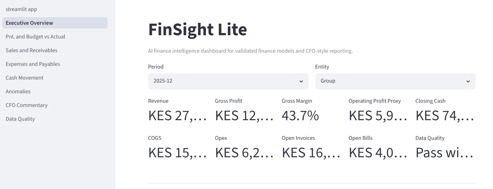
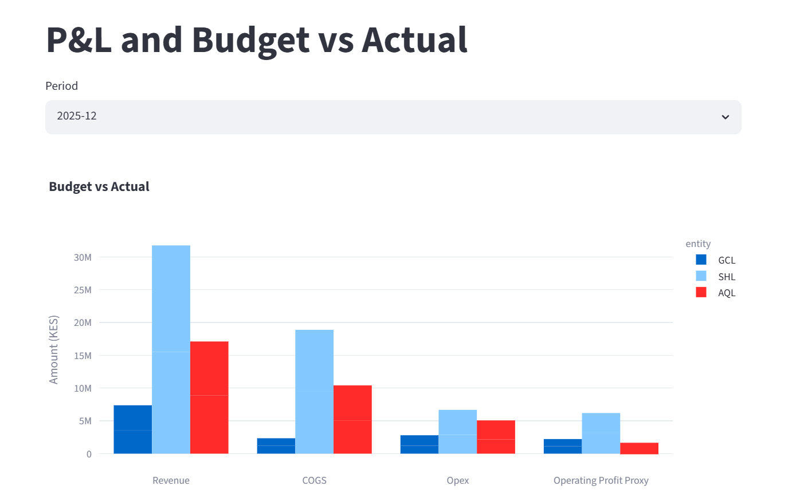
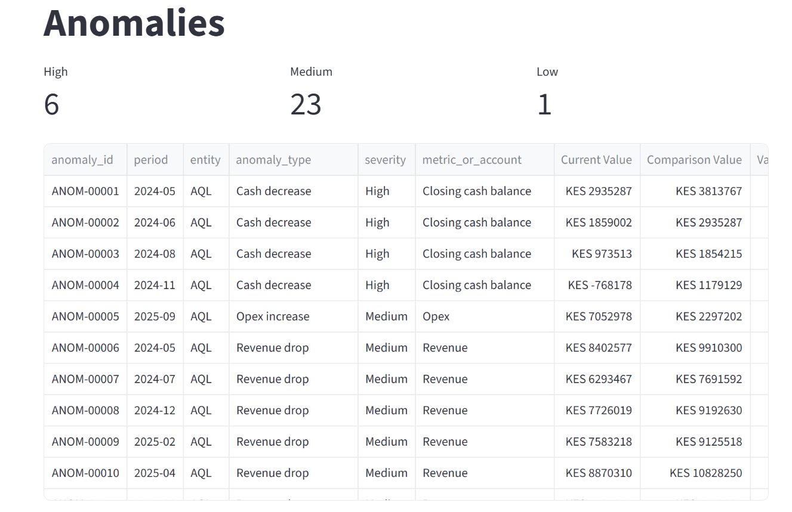
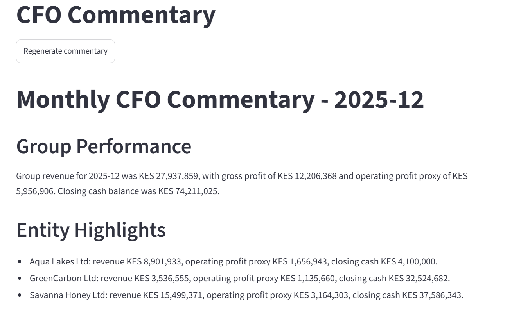
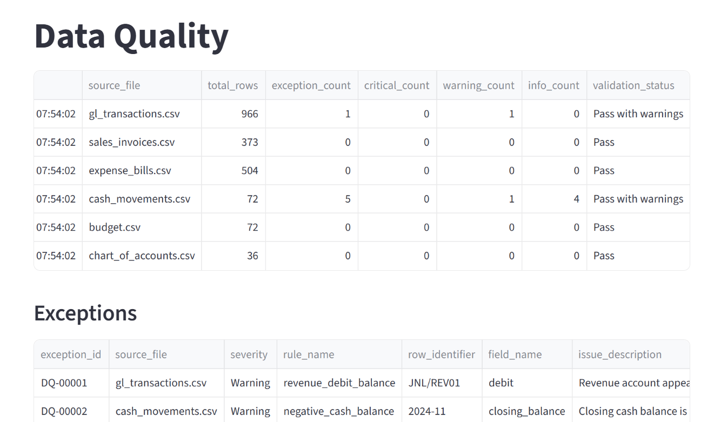

# FinSight Lite

**AI finance intelligence dashboard for turning raw ERP/accounting exports into validated finance models, anomaly detection, KPI dashboards, and CFO-style commentary.**

FinSight Lite demonstrates how finance teams can move from raw ERP/accounting exports to validated finance models, anomaly detection, KPI dashboards, and CFO-style commentary. The system is intentionally control-first: AI commentary is generated only after data validation and finance modelling.

## Problem Statement

Finance teams often receive messy exports from accounting or ERP systems and are asked to produce reliable management insight quickly. A chat interface over raw numbers is not enough. Source data needs validation, controlled transformation, exception reporting, and finance-friendly modelling before commentary is useful.

## Solution Summary

FinSight Lite loads realistic multi-entity finance exports, validates them, stores the controlled data in DuckDB, transforms it through dbt, and presents finance KPIs in Streamlit. It then generates explainable anomaly records and CFO-style commentary from governed finance outputs rather than raw files.

## Architecture

```text
Raw finance CSV exports
        ↓
Data validation layer
        ↓
DuckDB finance database
        ↓
dbt staging models
        ↓
dbt finance marts
        ↓
Anomaly detection
        ↓
Streamlit dashboard
        ↓
CFO-style commentary
```

The design is intentionally control-first: the AI commentary layer is downstream of validation, transformation, and anomaly detection rather than being allowed to interpret raw, uncontrolled data directly.

## Verified MVP Outputs

The first MVP pipeline has been verified successfully:

- 966 GL transaction rows processed
- 72 monthly P&L rows generated
- 6 data quality exceptions surfaced
- 30 finance anomalies generated
- 15 dbt models passed
- 4 dbt tests passed
- 3 pytest tests passed
- Streamlit dashboard returned HTTP 200 locally

These outputs demonstrate the full pipeline from raw finance exports through validation, DuckDB loading, dbt transformation, anomaly detection, dashboarding, and CFO-style commentary generation.

## Features

- CSV ingestion for GL transactions, sales invoices, expense bills, cash movements, budgets, and chart of accounts.
- Data quality validation with exception and summary outputs.
- DuckDB local finance database for raw and controlled reporting tables.
- dbt staging and mart models for monthly P&L, budget vs actual, cash, revenue, expenses, vendors, invoices, and KPI summary.
- Streamlit dashboard with executive overview and finance analysis pages.
- Explainable anomaly detection using finance-friendly rules.
- Deterministic CFO-style commentary that works without paid API access.

The P&L mart uses `operating_profit_proxy` as the profit measure. Depreciation is included in Opex in this MVP dataset, so this metric should be read as a practical operating profit proxy rather than a formal EBITDA measure.

## Tech Stack

- Python
- Pandas
- DuckDB
- dbt-core and dbt-duckdb
- Streamlit
- Plotly
- Pytest
- Ruff and Black

## Demo Workflow

```powershell
make all
streamlit run app/streamlit_app.py
```

`make all` runs the core MVP flow:

1. Validate uploaded sample data
2. Load data into DuckDB
3. Run dbt models
4. Generate anomalies
5. Generate CFO commentary

Direct verification commands:

```powershell
cd dbt_finance
dbt run --profiles-dir .
dbt test --profiles-dir .
cd ..
pytest
```

## Screenshots











## Data Quality and Control-First Design

Validation covers account-code mapping, required fields, date validity, debit and credit checks, amount reconciliation, invoice and bill status, cash reconciliation, budget completeness, and entity checks. The outputs are written to:

- `outputs/dq/dq_exceptions.csv`
- `outputs/dq/dq_summary.csv`

## Control-First Finance AI Design

FinSight Lite is built around a control-first finance AI design.

The system does not ask an AI model to interpret raw finance exports directly. Instead, it first validates the source data, loads it into DuckDB, transforms it through dbt finance models, flags data quality exceptions and anomalies, and only then generates CFO-style commentary from governed outputs.

The goal is not to let AI invent financial insight. The goal is to help finance teams move faster while preserving auditability, reviewability, and management discipline.

## AI Commentary Design

The commentary module is designed to use structured finance outputs only, including:

- KPI summary
- budget vs actual results
- cash movement
- anomaly records
- data quality summary

If no AI API key is provided, the project falls back to deterministic template commentary. This ensures the MVP remains fully runnable without paid API access.

The commentary layer must not invent numbers. It should only summarize and explain metrics already produced by the validated finance pipeline.

## Project Structure

```text
app/                  Streamlit dashboard and pages
data/sample/          Demo finance CSV exports
data/processed/       Local DuckDB finance database
dbt_finance/          dbt project, staging models, and marts
outputs/              DQ, anomaly, commentary, and screenshot outputs
src/finsight/         Validation, loading, anomaly, and commentary code
tests/                Basic pytest coverage
```

## How to Run Locally

```powershell
python -m venv .venv
.\.venv\Scripts\Activate.ps1
pip install -r requirements.txt
make all
streamlit run app/streamlit_app.py
```

If `make` is not available on Windows, run:

```powershell
python -c "import sys; sys.path.insert(0, 'src'); from finsight.validate import main; main()"
python -c "import sys; sys.path.insert(0, 'src'); from finsight.load_duckdb import main; main()"
cd dbt_finance
dbt run --profiles-dir .
cd ..
python -c "import sys; sys.path.insert(0, 'src'); from finsight.anomalies import main; main()"
python -c "import sys; sys.path.insert(0, 'src'); from finsight.commentary import main; main()"
streamlit run app/streamlit_app.py
```

## Tests and Verification

```powershell
cd dbt_finance
dbt run --profiles-dir .
dbt test --profiles-dir .
cd ..
pytest
ruff check app src tests
```

Expected core outputs:

- `data/processed/finsight.duckdb`
- `outputs/dq/dq_exceptions.csv`
- `outputs/dq/dq_summary.csv`
- `outputs/anomalies.csv`
- `outputs/board_summary/monthly_cfo_commentary.md`
- `outputs/board_summary/monthly_cfo_commentary.txt`

## What This Project Demonstrates

FinSight Lite demonstrates the following practical finance AI and analytics capabilities:

- Finance data modelling: raw ERP-style exports are transformed into monthly P&L, budget, cash, revenue, expense, vendor, invoice, and KPI marts.
- dbt transformation logic: staging and mart models create a governed reporting layer from messy source data.
- Data quality controls: the pipeline surfaces validation exceptions before reporting and commentary.
- Explainable anomaly detection: anomalies are generated using finance-friendly rules such as revenue drops, budget overspends, large transactions, and cash movement issues.
- AI-assisted CFO commentary: management commentary is generated only from controlled finance outputs, not raw uncontrolled data.
- Practical finance systems thinking: the project combines accounting logic, reporting discipline, analytics engineering, and AI workflow design.

## Project Summary

Built FinSight Lite, an AI finance intelligence dashboard that transforms realistic multi-entity finance exports into DuckDB/dbt finance marts, validates data quality, detects transaction-level and KPI-level finance anomalies, and generates CFO-style commentary from controlled outputs. The MVP processed 966 GL rows, produced 72 monthly P&L rows, surfaced 6 data-quality exceptions and 30 finance anomalies, with passing dbt, pytest, and linting checks.

## Limitations

This is a local-first MVP. It does not include authentication, live ERP connectors, role-based access control, complex forecasting, multi-user SaaS features, or production deployment infrastructure.

## Future Roadmap

- Odoo connector
- Xero/QBO connector
- Automated board pack export
- Audit evidence pack generator
- RAG over finance SOPs and policies
- Agentic close checklist
- Human approval workflow
- Email distribution of CFO summary
- Multi-currency revaluation
- Intercompany reconciliation module
- AR/AP ageing dashboard
- Payroll variance analysis
- Inventory and COGS analytics
- Deployment with authentication
